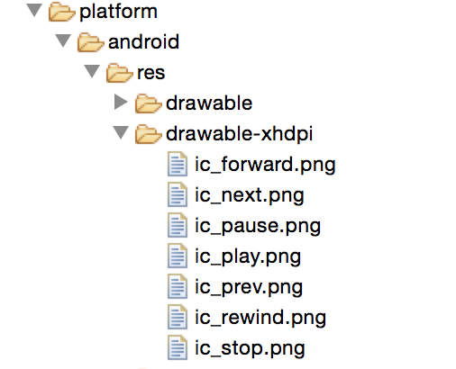

#Ti.AudioControls

For an AudioPlayer inside an app we need "remote" controls to watch meta details and control (play/stop/skip).
We use three ways:

1. listener on "keyboard" on a headset
2. Widget over lockscreen (only available for older devices)
3. Widget in notification (only available for newer devices)

The left screenshot shows the lockscreen widget for older devices. The buttons comes from system. The other screenshots illustrate the modern notifications. The symbols comes from res/drawable folder and can change by coder on Titanium side.   
In future version you can change at runtime. Propose you have podacsts/radiostations with different color schemas, you can put all icons in the folder and select the color by selecting of resource.

The big image (album cover etc.) use remote URL as address. It will be cached by system (make it sense?). The small icon on the right bottom corner and on statusbar must be with white background and comes from res folder too. It is modifyable. You can control the background color of this icon from JS side. Default is a dark gray.



     


###Headphone buttons
If we nothing do then the following automatism is working: if a headphone with 4 contacts is plugged, then the clicking of main button (in the middle) starts the player which has focus. Therefore the Titanium AudioPlayer can control with it. If you need an other behaviour (usage of double click for other function), then you can use [Ti.HeadphoneButtons](https://github.com/AppWerft/Ti.HeadphoneButtons).

###Widgets
For remote controling you can use a strip in notification tray (prefered solution) or a widget over lockscreen. This lockscreen widget is only available for older devices. Since Lollipop this feature will not supported.


### Javascript interface (aka "usage")

This is the Javascript interface:

```javascript
var AudioControls = require("de.appwerft.audiocontrols");
var Lorem = require("vendor/loremipsum"); // for generating random text

AudioControls.createRemoteAudioControl({
	onClick : function(_event) {
		console.log(_event);
	},
	lollipop : AudioControls.NOTIFICATION, 
	lockscreenWidgetVerticalPosition : WIDGET_POSITION_BOTTOM,  // only for older devices
	iconBackgroundColor : "#ff0000",
	vibrate : 20, //duration of vibrate on click in ms, default 20
	hasProgress : false, // default false
	hasActions : true // default true
});

AudioControls.updateRemoteAudioControl({
	image : "http://lorempixel.com/120/120/cats" + "?_=" + Math.random(),
	artist : Lorem(10),
	title : Lorem(2)
});
setInterval(function() {
	AudioControls.updateRemoteAudioControl({
		image : "http://lorempixel.com/120/120/cats" + "?_=" + Math.random(),
		artist : Lorem(12),
		title : Lorem(4)
	});
}, 30000);
setInterval(function() {
	AudioControls.setProgress(Math.random());
}, 300);

```

Lollipop devices (API level 21/22) supports both types of widget, with the parameter 'lollipop' the user can select one type. Default is Notification.

##Technical realisation

The widgets are not "normal" views. They use underlaying [RemoteViews](https://developer.android.com/reference/android/widget/RemoteViews.html). For notifications we have three possibilties to realize it:

1. custome style, this solution uses RemoteViews too.
2. standard style with added actions (buttons), this module uses this solution,
3. usage of [MediaStyle](https://developer.android.com/reference/android/support/v7/app/NotificationCompat.MediaStyle.html). This solution generates a ready to use solution and controls the player internally. We wouldn't works with callbacks, but this solution needs for reference a MediaSession. Maybe next version of Ti.Media.AudioPlayer supports this.

For moderner devices (Android 4.1) we could use BigViewStyle, in this case we could add Viualization to widget etc. (Maybe in future versions of this module). For realizing this we use the property `contentView` and bind it to a RemoteViews, which will created from a own XML layout.

